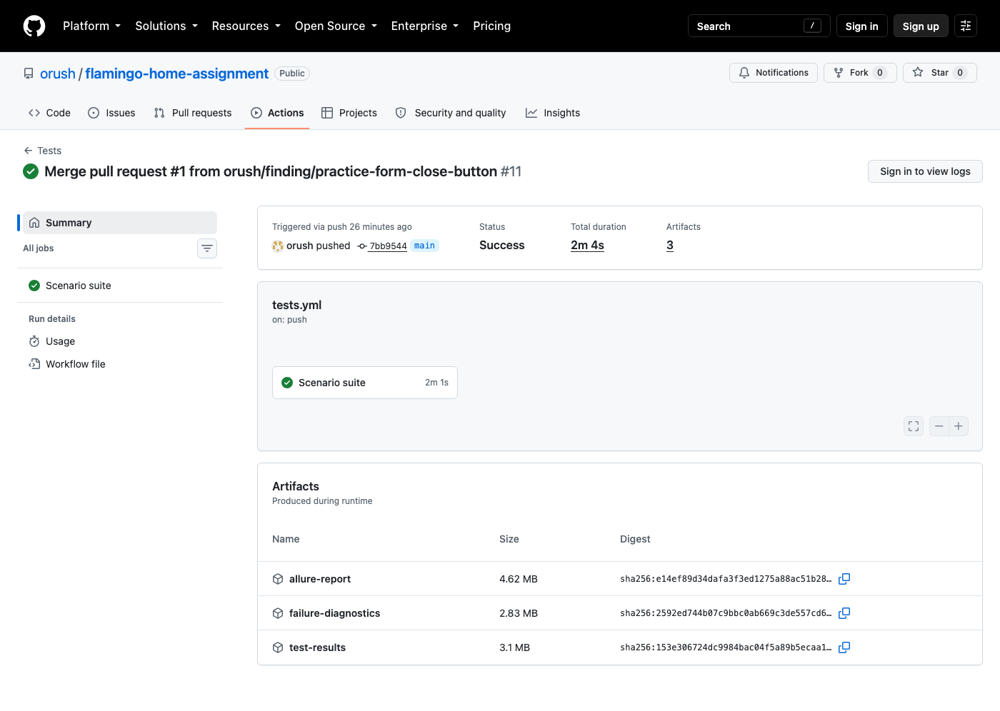
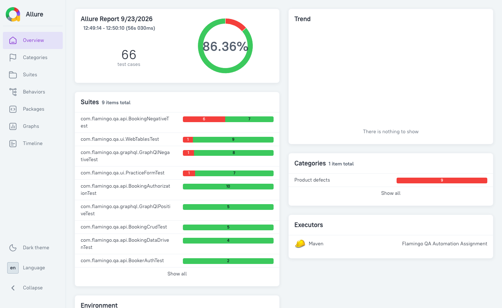
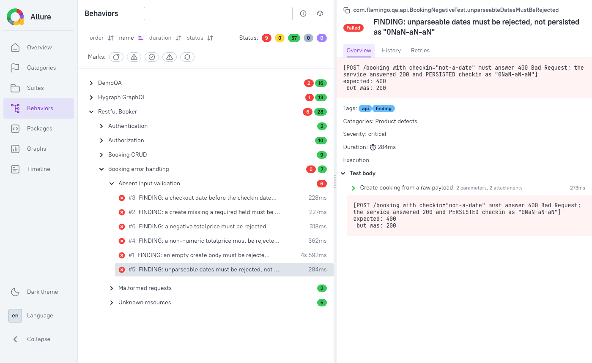

# QA Automation Test Suite

[](https://github.com/orush/flamingo-home-assignment/actions/workflows/tests.yml)
[](https://github.com/orush/flamingo-home-assignment/actions/workflows/framework.yml)

REST, GraphQL and UI test automation for three public services — Restful Booker,
the Hygraph GraphQL example API and DemoQA — built on JUnit 5, REST Assured,
Playwright for Java, AssertJ and Jackson, with Allure reporting and GitHub
Actions CI.

**55 scenario tests** (31 REST, 12 GraphQL, 12 UI) and **35 framework
self-tests**: 108 executions in all, since parameterized tests expand. They run
in parallel in about 25 seconds. **13 defects** in the services under test are
documented below; 9 of them are asserted as deliberately failing tests.

## Prerequisites

- **Java 17 or newer.** The build targets release 17; CI runs on Temurin 17.
- **Maven 3.6+**, or nothing: the bundled wrapper, `./mvnw`, downloads Maven itself.
- **Chromium for Playwright**, installed by Playwright rather than taken from a
  system Chrome (see below).

### Configuration — required before the first run

No endpoint or credential is stored in this repository. Create your own `.env`
from the template and fill in the five values:

```bash
cp .env.example .env
```

| Key | Where it comes from |
| --- | --- |
| `BOOKER_BASE_URL` | the assignment brief (Restful Booker base URL) |
| `BOOKER_USERNAME` | the assignment brief (auth example payload) |
| `BOOKER_PASSWORD` | the assignment brief (auth example payload) |
| `GRAPHQL_ENDPOINT` | the Hygraph playground: choose the Video Streaming example schema and read the request URL from the browser's network panel |
| `UI_BASE_URL` | the assignment brief (DemoQA base URL) |

`.env` is gitignored. Any value can instead be given as an environment variable
(`BOOKER_BASE_URL=...`) or a system property (`-Dbooker.base.url=...`). To check
the setup:

```bash
./mvnw clean test -Dtest=ConfigLoaderTest
```

A missing value fails with a message naming the key.

### Browsers

```bash
./mvnw compile exec:java -Dexec.mainClass=com.microsoft.playwright.CLI \
  -Dexec.args="install chromium"      # on Linux: "install --with-deps chromium"
```

Prefix it with `PLAYWRIGHT_SKIP_BROWSER_GC=1` if other Playwright projects live
on the same machine. By default the installer deletes browser builds in the
shared cache that belong to other Playwright versions.

## How to Run

Always include `clean`. Without it Maven keeps stale files in `target/`,
including old test configuration (see *A serial baseline that was not serial*).

```bash
# Run all tests
./mvnw clean test

# Run only API tests (REST + GraphQL)
./mvnw clean test -Dgroups="api"

# Run only UI tests
./mvnw clean test -Dgroups="ui"
```

Beyond the brief's three commands:

```bash
# The build's verdict: everything except the known-defect tests. Must be green.
./mvnw clean test -DexcludedGroups="finding"

# Only the framework self-tests (CI runs them in their own workflow)
./mvnw clean test -Dgroups="framework"

# The defect report: only the known-defect tests. These are EXPECTED to fail;
# each failure message names the input, the expected response and what happened.
./mvnw clean test -Dgroups="finding"

# Watch the browser
./mvnw clean test -Dgroups="ui" -Dui.headless=false

# Allure report: a live server, or a single self-contained HTML file
ALLURE_NO_ANALYTICS=true ./mvnw allure:serve
ALLURE_NO_ANALYTICS=true ./mvnw allure:report   # target/site/allure-maven-plugin/index.html
```

`ALLURE_NO_ANALYTICS` stops the report from loading a Google Analytics tag.

A plain `./mvnw clean test` includes the findings, so it ends in `BUILD FAILURE`
by design, reporting the 9 defects. Use `-DexcludedGroups="finding"` for a
pass/fail verdict on the suite itself.

## Test Strategy

- **Probe before asserting.** Every endpoint and page was exercised by hand
  before a test was written, and each test asserts what the service was observed
  to do. Several behaviours are not what you would guess (see below), and the UI
  selectors in the original plan targeted a version of DemoQA that no longer
  exists.
- **Defects fail loudly; the build stays meaningful.** A *finding* asserts what
  a correct service would do, so it fails, and its failure message is the
  defect report. Findings carry `@Tag("finding")`, so the build can gate on
  everything else. Asserting the buggy behaviour instead, to keep the suite
  green, would quietly bake the defect into the expected contract.
- **Negative paths get equal weight.** Over half the scenario tests, 33 of 55,
  exercise failure modes: authorization for every endpoint (no token, valid token, forged
  token), malformed input, unknown resources, and every GraphQL error shape.
- **Independent tests.** Each test seeds its own data and asserts only on it,
  with no ordered chains between tests. They do not delete what they create:
  the services reset themselves, cleanup is not required, and an extra request
  per test is load on a public service.
- **Respect the public services.** One cached auth token for the whole run, a
  fixed four threads, connect and read timeouts, and no retries except for network
  errors.
- **Data-driven where the variation is the point**: optional booking fields,
  invalid GraphQL variables, invalid web-table records, invalid form fields.

### What is covered

| Area | Tests |
| --- | --- |
| Restful Booker | auth, full CRUD including `PATCH`, an authorization matrix over every endpoint, unknown resources, malformed requests, input validation |
| Hygraph GraphQL | a page-size limit, paging the whole collection with no gaps or overlaps, fetch by id, variables that are provably never interpolated, a fragment with a nested `Movie → publishedBy → name` hop, and every error shape |
| DemoQA web tables | add, edit, delete, search, field validation, sorting |
| DemoQA practice form | a complete submission (upload, date picker, dropdowns), a required-fields-only submission, an empty submission, field validation, closing the confirmation |

## Findings

Defects in the systems under test, found by the suite.

| # | Service | Severity | Finding | Test |
| --- | --- | --- | --- | --- |
| 1 | Restful Booker | Critical | `POST /booking` accepts writes with no token (200). | pinned |
| 2 | Restful Booker | Critical | `GET /booking` lists every booking id with no token. | pinned |
| 3 | Restful Booker | Critical | `GET /booking/{id}` returns guest names with no token. With #2, every guest record is readable by anyone. | pinned |
| 4 | Restful Booker | Critical | Unparseable dates are accepted and **persisted as `0NaN-aN-aN`**. | fails |
| 5 | Restful Booker | Critical | A non-numeric `totalprice` is accepted and **silently stored as `null`**. | fails |
| 6 | Restful Booker | Normal | An empty create body, or one missing a required field, returns 500 instead of 400. | fails ×2 |
| 7 | Restful Booker | Normal | A checkout date before the checkin date, and a negative price, are accepted. | fails ×2 |
| 8 | Restful Booker | Low | `PUT`/`PATCH`/`DELETE` on a missing booking return 405, not 404. | pinned |
| 9 | Restful Booker | Low | A successful `DELETE` returns `201 Created`. | pinned |
| 10 | Restful Booker | Low | Bad credentials return 200 with `{"reason":"Bad credentials"}`, not 401. | pinned |
| 11 | Hygraph | Low | Field errors carry `path` under `extensions`, not as the top-level key the GraphQL specification requires. | fails |
| 12 | DemoQA | Normal | The web table cannot be sorted: no column header responds to clicks, so the brief's sorting scenario fails. | fails |
| 13 | DemoQA | Normal | The practice form confirmation's Close button does nothing: the dialog and its backdrop stay over the form, and only Escape closes it. | fails |

*fails* — the test asserts correct behaviour and fails, so the defect is
reported on every run. If the service is fixed, the test starts passing.
*pinned* — the test passes and asserts the observed behaviour, naming the
correct behaviour in its title. These are Restful Booker's documented design
(its API documents the token as required only for `PUT`, `PATCH` and `DELETE`)
or low-impact quirks. The authorization matrix also shows that where the token
*is* enforced, it is enforced properly: a forged token is rejected, not just a
missing one.

## Architecture

Reusable framework code lives in `src/main/java`; `src/test/java` holds only
test scenarios. A class in `main` is therefore self-evidently reusable, and the
compiler enforces the boundary.

| Package | Responsibility |
| --- | --- |
| `config` | Typed configuration (system property → environment → `.env` → default), and `Secret`, a credential type that cannot be printed by accident |
| `api` | Shared REST Assured specification with timeouts; `ApiResponse<T>` for both happy and error paths; the shared Jackson mapper |
| `api.booker` | Restful Booker clients and models; a token fetched once per run |
| `api.graphql` | GraphQL request and response types, the client, and a `.graphql` file loader |
| `reporting` | Masks credentials in everything written to the Allure report |
| `ui` | Playwright lifecycle, a first-party-only network policy, exact-text matching, retrying assertions (`Eventually`) |
| `ui.pages` | Page objects and components: `DatePicker`, `ReactSelect`, dialogs |
| `junit` | `@ApiTest`, `@UiTest`, `@RetryOnNetworkError`, page injection, failure capture |
| `data` | Test data factory |

Tests are wired by composition, not inheritance. `@UiTest` bundles `@Test`, the
`ui` tag and the Playwright extension, and the page arrives as a method
parameter:

```java
@UiTest
void addsRecord(Page page) { ... }
```

There are deliberately no `*TestBase` classes: JUnit 5's extension model does the
same job without using up the single superclass. The same extension supports
several isolated browser sessions in one test, as
`void t(@Actor("alice") Page a, @Actor("bob") Page b)`, which a framework
self-test exercises.

Page objects expose actions and data and never assert. Every check lives in a
test, so one page object serves positive and negative tests alike.

In `src/test/java`, the scenarios sit in `api`, `graphql` and `ui`, and the
framework's own tests sit together in `framework`. Each of those classes also
carries `@Tag("framework")`, which is how the two CI workflows split them.

## Challenges & Solutions

### The APIs do not behave the way you would guess

Everything was probed before any assertion was written.

| Scenario | You might expect | Actual |
| --- | --- | --- |
| Auth with a bad password | 401 | **200** with `{"reason":"Bad credentials"}` |
| Successful `DELETE /booking/{id}` | 200 or 204 | **201 Created** |
| `PUT` without a token | 401 | **403** `Forbidden` |
| `PUT`/`PATCH`/`DELETE` of a missing booking | 404 | **405** `Method Not Allowed` |
| GraphQL, missing entity | an errors array | **200**, `data.movie: null`, no `errors` key |
| GraphQL, syntax error or unknown field | 200 with errors | **400**, `data: null` with `errors[]` |
| GraphQL, mutation on a missing record | — | **200**, a `null` field *and* an error |
| GraphQL, mutation on an existing record | — | **403**, `data: null` |

The brief asks whether GraphQL errors arrive as HTTP 200 with `data: null` or as
an errors array. On Hygraph it depends on **when** the request fails. If
parsing or validation fails, nothing executes: 400, no data. Once it executes,
problems are reported per field with a 200 — a missing entity is simply `null`,
while a denied field is `null` *plus* an error (GraphQL's partial-result shape).
A mutation that reaches a real record fails a permission check: 403. An early
probe used a fake id and saw only the 200 shape; the test, using a real id, got
403. Whether the target exists changes the whole response.

### API

**A 418 that had nothing to do with teapots.** Every Restful Booker write failed
with `418 I'm a Teapot`, while the identical payload sent from curl succeeded.
Logging the full exchange showed REST Assured expanding `ContentType.JSON` on
the `Accept` header into four media types, and Restful Booker answers 418 to
anything but exactly `application/json`. The fix is one line. The failure was
completely deterministic, which is why retries here are scoped so narrowly: a
blanket retry would have hidden it.

**Retries that cannot hide a defect.** `@RetryOnNetworkError` retries only when
an `IOException` is in the cause chain: a timeout, a refused connection, a DNS
failure. An assertion failure fails on the first attempt, and a repeated attempt
is reported as *aborted* and labelled `(retry 1 of 2)`, never swallowed into a
pass. This is proven with JUnit's `EngineTestKit`, which runs deliberately
failing example tests in isolation. Writing it exposed a real gap: REST Assured
had **no timeout**, so a stalled service would have hung the build. Timeouts now
come from configuration, and a test against a local server that never replies
confirms it, including failing when the timeouts are removed.

### UI

**Selectors written for a page that no longer exists.** The plan's DemoQA
selectors targeted the familiar react-table version of the web tables page,
whose rows are padded with blank ones. The live page has been rebuilt as a plain
HTML table. Every UI task started by dumping the real DOM, so this surfaced
before any page object was written, along with the discovery that sorting had
been removed entirely (finding #12).

**A date picker that steals focus.** Filling the form end to end left Subjects
empty, with no error. The failure screenshot showed a focus ring still on the
date input. Recording focus events in the page gave the sequence: the calendar
closes, the test focuses Subjects, and about 10 ms later the date picker moves
focus back to its own input — and the subjects autocomplete clears its text on
blur. `DatePicker` now waits for that specific focus return rather than
sleeping, and fails with an explanation if the widget ever stops doing it.

**A regex that meant something else in the browser.** Every form test that
chose a radio button timed out. The text filter used `Pattern.quote`, whose
`\Q…\E` syntax is Java-only. Playwright runs text filters in the browser's
JavaScript engine, which reads `\Q` as a plain `Q`, so "Female" became
`/^QFemaleE$/` and matched nothing. `ExactText` escapes characters individually
instead, and a unit test keeps `\Q…\E` from ever coming back.

**Ads that intercept clicks.** A probe of DemoQA found about 25 rotating ad and
tracking hosts, so blocking them by name would soon go stale. Each browser
context instead lets only first-party traffic through. On the web tables page
that removes every ad frame and cuts page settle time by about 45%. The matcher
is unit-tested against look-alike domains, which a naive `endsWith` would let
through.

**Screenshot-on-failure that never fires.** The obvious hook,
`TestWatcher.testFailed`, runs after the test's browser context has been closed,
leaving nothing to photograph. Capture runs in `afterEach` instead, saving a
full-page screenshot and a Playwright trace for every page the test opened. This
was proven by deliberately failing a two-browser test.

**Closing browsers that belong to other threads.** Each worker thread owns a
browser, since Playwright objects are unsynchronised. The first design assumed
that meant they could never be closed cleanly. Playwright's own JUnit
integration showed otherwise: the rule is no *concurrent* use, not thread
affinity. So every browser is closed once, after the run, and none survive it.
JUnit's thread pool is also capped at four threads, because by default it may
add up to 256 compensating threads when workers block, each of which would
launch another browser.

**Assertions that wait without hiding defects.** A UI check read once can catch
the page mid-render. `Eventually`, written in-house rather than pulled in as a
library, re-runs a hard or soft assertion block for up to five seconds. Each
attempt reads the page afresh and a soft block collects afresh, so the report
lists only the last attempt's failures. It retries only assertion failures and
Playwright read errors; anything else is a bug in the test and fails at once. At
the deadline the last error is rethrown unchanged, with a note of how many
attempts were made, so a finding's defect report reads as before. A check that
is wrong every time still fails, just later. Negative checks, such as "the
dialog stays open", stay outside: they are bounded waits already, and an absence
confirmed twice proves no more than once. Self-tests pin each of these rules, and
disabling the assertion retry fails three of them.

### Reporting and secrets

**Credentials in the test report.** Allure writes every `@Step` argument and
HTTP exchange into its raw results, which CI publishes, so the auth password
and session tokens ended up in the artifacts. Allure's `@Param(mode = MASKED)`
looked like the fix, but it hides values only in the *rendered* report; the raw
JSON still held them in plain text. Now credentials are a `Secret` type that
prints as `******`, a redacting filter masks them in bodies, headers and
cookies, and CI scans every artifact for the real values before uploading. The
scan refuses to report success if it inspected no files.

**A report that tracks its readers.** Allure 3's default report embeds a Google
Analytics tag, with no switch to turn it off. The report uses Allure's
`allure2` plugin instead, which honours `ALLURE_NO_ANALYTICS`, and is built as
one self-contained HTML file that opens straight from a downloaded artifact.

**Keeping configuration out of the repository.** Endpoints and credentials live
in `.env` and in GitHub Actions secrets, never in a tracked file, and required
keys have no default, so a missing one fails fast. To be clear about scope: the
credentials are published in the brief and in the service's own documentation,
and all three services are public demos. Nothing here is a live secret; the
arrangement demonstrates the practice where getting it wrong costs nothing.

### Build

**A serial baseline that was not serial.** Measuring the parallel speed-up
first suggested parallel runs were *slower*: 25 s against 22 s. The "serial"
run was not serial. A temporary `junit-platform.properties`, created earlier to
check thread safety, had been deleted from `src/test/resources`, but `mvn test`
without `clean` never removes stale files from `target/`, so every later run
kept loading it. Measured properly, serial takes 1:09 and parallel 25 s. As a
side effect, the suite had already passed dozens of runs under harsher
concurrency than it ships with. Hence `clean` in every command above.

**Versions from a stale index.** The first dependency pins came from Maven
Central's search index, which proved to be over a year out of date. Every pin
was re-resolved from the authoritative repository metadata, moving to JUnit
5.14, REST Assured 6, Playwright 1.63 and Allure 2.35. On JDK 26, AspectJ needed
1.9.25.1 to read the newer class files, and Lombok needed a `lombok.config` to
stop reporting a Jackson 2/3 ambiguity that did not exist.

## What I Would Add With More Time

- **Contract tests** from the Restful Booker API description and the GraphQL
  schema, so a breaking change shows up as a schema difference rather than a
  broken assertion.
- **A record-and-replay mode** (WireMock) so the suite can run offline and ride
  out an outage. The brief allows mocking a service that is down; recorded
  responses would make that automatic.
- **A cross-browser CI matrix.** The browser is already configuration
  (`UI_BROWSER`), so this is a workflow change, not a code change.
- **Allure history on GitHub Pages**, so trends and flakiness are visible over
  time rather than one run at a time.
- **Network-error retry by default** for every API test. It cannot hide an
  assertion failure, so it is safe; the cost is that each retried test appears
  as a template with invocations in reports.
- **Accessibility and visual-regression checks** on the DemoQA pages.
- **Secret scanning at commit time** (for example gitleaks), alongside the
  artifact check CI already runs.

## Test Report

CI has two workflows. [Tests](https://github.com/orush/flamingo-home-assignment/actions/workflows/tests.yml)
runs the scenarios and the findings;
[Framework self-tests](https://github.com/orush/flamingo-home-assignment/actions/workflows/framework.yml)
runs the `framework` tests, so a broken framework is told apart from a broken
service at a glance. Both share their setup through `.github/actions/setup`.

Every Tests run publishes three artifacts: `allure-report` (a single HTML file),
`test-results` (raw Allure results and Surefire reports) and
`failure-diagnostics` (screenshots and Playwright traces, which always include
the failing sorting finding). The framework workflow publishes the same three,
prefixed `framework-`. For viewers signed in to GitHub, the run page also
summarises the suite and lists each finding with its defect message.

A CI run — green, with no warnings or errors. The findings run in a separate,
non-gating step:



The Allure report produced by CI:



A finding in the report. The failure message is the defect report:



## Design Documents

The work was designed before it was built, and both documents were kept in step
with what was learned along the way:

- [Design specification](docs/superpowers/specs/2026-09-22-qa-automation-framework-design.md)
- [Implementation plan](docs/superpowers/plans/2026-09-22-qa-automation-framework.md)
